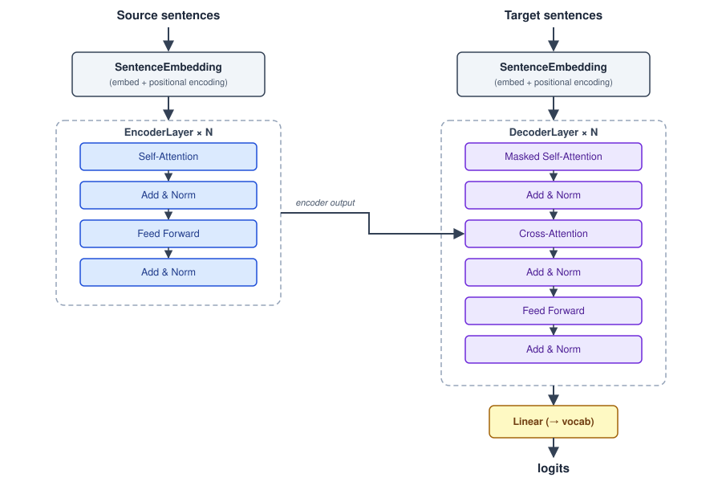

# Architecture Overview



This implementation follows the original Transformer architecture from "Attention Is All You Need" (Vaswani et al., 2017): an **Encoder** stack and a **Decoder** stack, each made of `N` identical layers stacked on top of each other.

## Notation used throughout these docs

| Symbol | Meaning |
|---|---|
| `B` | batch size |
| `S` | sequence length (number of tokens per sentence, after padding) |
| `d_model` | embedding dimension (512 in the example config) |
| `h` | number of heads (`num_heads`) |
| `d_k` | dimension per head = `d_model / num_heads` |
| `V` | vocabulary size |

## Scope of the implementation

Everything in `src/` implements only the **forward pass**, in pure NumPy (`Parameter` has a `.grad` field, but no class ever computes a gradient or updates a weight). This is a learning implementation of the architecture, not something meant to actually train a model — see [known-issues.md](known-issues.md) for the specific limitations.

## End-to-end data flow (per `Transformer.forward`, `src/Transformer.py:313-326`)

```
english sentences (batch of str)
        │
        ▼
 SentenceEmbedding (encoder)  ── tokenize → embedding lookup → + positional encoding → dropout
        │  shape: (B, S, d_model)
        ▼
 Encoder stack × num_layers    ── self-attention → add&norm → FFN → add&norm
        │  shape: (B, S, d_model)   ("encoder output", used as K/V for the decoder)
        ▼
        │                      kannada sentences (batch of str)
        │                              │
        │                              ▼
        │                       SentenceEmbedding (decoder)
        │                              │  shape: (B, S, d_model)
        │                              ▼
        └──────────────────────▶ Decoder stack × num_layers
                                   ── masked self-attention → add&norm
                                   ── cross-attention (Q from decoder, K/V from encoder output) → add&norm
                                   ── FFN → add&norm
                                        │  shape: (B, S, d_model)
                                        ▼
                                 Linear(d_model → kn_vocab_size)
                                        │  shape: (B, S, vocab_size)
                                        ▼
                                 logits (pre-softmax) for every position
```

## Building blocks and where they are used

| Block | Defined as | Used in |
|---|---|---|
| `softmax`, `scaled_dot_product_attention` | top-level functions | `MultiHeadAttention`, `MultiHeadCrossAttention` |
| `Parameter`, `Linear` | base classes | every linear projection (`qkv_linear`, `out_linear`, FFN, final linear layer) |
| `MultiHeadAttention` | self-attention (Q, K, V from the same source) | `EncoderLayer` (self-attn), `DecoderLayer` (masked self-attn) |
| `MultiHeadCrossAttention` | Q from a different source than K/V | `DecoderLayer` (encoder-decoder attention) |
| `LayerNormalization` | normalizes over the last (feature) axis | after every sub-layer (post-norm, the classic "Add & Norm") |
| `PositionwiseFeedForward` | 2 Linear layers + ReLU + dropout | `EncoderLayer`, `DecoderLayer` |
| `Dropout` | training/inference dropout | after attention, after FFN, after embedding |
| `PositionalEncoding` | sin/cos by position | `SentenceEmbedding` |
| `Embedding` | lookup table by token id | `SentenceEmbedding` |
| `SentenceEmbedding` | tokenize sentence → embedding + positional encoding | `Encoder`, `Decoder` (only in `src/Transformer.py`) |

## Three source files, three roles

`src/` has 3 files with **largely overlapping** content but different purposes:

- **`src/Encoder.py`** — standalone build containing only the encoder stack (no embedding, no mask support). Used to validate the attention + FFN + norm mechanics before wiring in embeddings.
- **`src/Decoder.py`** — standalone build containing only the decoder stack (no embedding). Used to validate masked self-attention + cross-attention.
- **`src/Transformer.py`** — the full, self-contained build, wiring together `Embedding` → `Encoder` → `Decoder` → final `Linear`, with mask support at every layer. **This is the file to use when running the full pipeline** (all notebooks under `test/` import from it).

Because the 3 files share many identically-named classes with near-identical logic, read [known-issues.md](known-issues.md) carefully — some of them differ in **behavior**, not just in whether embeddings are included.

## Where to go next

| File | Content |
|---|---|
| [attention.md](attention.md) | Scaled dot-product attention, Multi-Head Attention, Multi-Head Cross-Attention |
| [embedding.md](embedding.md) | `Embedding`, `PositionalEncoding`, `SentenceEmbedding` |
| [encoder.md](encoder.md) | `EncoderLayer`, `Encoder` |
| [decoder.md](decoder.md) | `DecoderLayer`, `Decoder` |
| [transformer.md](transformer.md) | The full `Transformer` class, masks, forward pass |
| [known-issues.md](known-issues.md) | Bugs/discrepancies found in the source |
